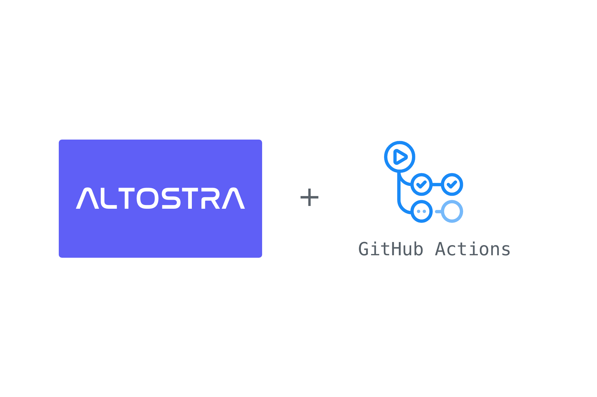

## About

Use this action to deploy Altostra projects.
An Altostra image is automatically created for the project, or you can provide one.

**See also**
* [login-action](https://github.com/altostra/login-action)

## Usage

### Inputs
Following inputs can be used as step.with keys

| Name  | Type  | Required | Description  |
|:-:|:-:|:-:|:-:|
| env-name | string | Yes |  The environment to which to deploy |
| instance-name | string | Yes |  The instance name to deploy |
| image-name | string | No |  Optional. The image name (i.e: 1.0.0, v2.4.1, alpha, dev, test, ...) |

## Example usage
```yaml
on: [push]

jobs:
  hello_world_job:
    runs-on: ubuntu-latest
    name: A basic Altostra job
    steps:
    - uses: actions/checkout@v2
    - id: Login
      uses: altostra/login-action@v1
      with:
        api-token: "${{ secrets.ALTO_API_TOKEN }}"
    - id: Push-Deploy
      uses: altostra/push-deploy-action@v1
      with:
        env-name: Production
        instance-name: githubTest
```
